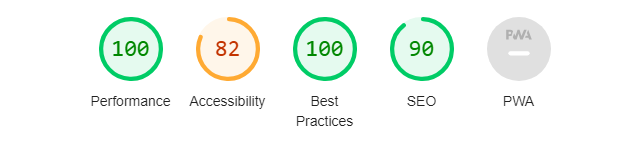
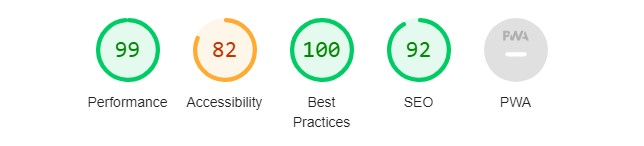

</img>

<h1>Frontend Mentor - Notifications Page Solution</h1>

<a href ="https://www.frontendmentor.io/challenges/notifications-page-DqK5QAmKbC/hub"><strong>Frontend Mentor Challenge</strong></a>

<!-- Profiles -->
&nbsp;&nbsp;&nbsp;
<!-- Status -->
&nbsp;&nbsp;&nbsp;

### Preview :camera_flash:
___

### PageSpeed Insights Score
#### Desktop

#### Mobile

### Links
____
|||
| :------ | :-------- |
| Solution URL: | |
| Live Site URL: | |
||| 

### The Challenge :man_technologist:
___
Users should be able to:

- Distinguish between "unread" and "read" notifications
- Select "Mark all as read" to toggle the visual state of the unread notifications and set the number of unread messages to zero
- View the optimal layout for the interface depending on their device's screen size
- See hover and focus states for all interactive elements on the page.

### Built With 
&nbsp;&nbsp;
&nbsp;&nbsp;

### Tools Used :hammer_and_wrench:
&nbsp;&nbsp;
&nbsp;&nbsp;
&nbsp;&nbsp;
&nbsp;&nbsp;

### Acknowledgement 
____
Challenge was provided by **[Frontend Mentor](https://www.frontendmentor.io)**

### Let's Connect :wave:
____
&nbsp;&nbsp;
&nbsp;&nbsp;
&nbsp;&nbsp;

